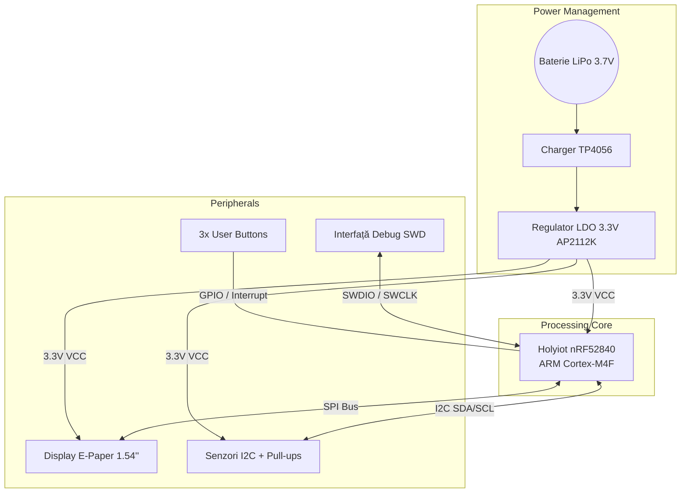

# InkTime v6 - Smartwatch cu Display E-Paper (nRF52840)

InkTime v6 este un proiect hardware de tip wearable, conceput pentru eficiență energetică extremă și afișaj permanent. Dispozitivul utilizează un ecran E-Paper de 1.54 inch și este bazat pe microcontrolerul nRF52840, oferind conectivitate Bluetooth Low Energy (BLE) într-un format compact.

---

## 1. Diagrama Bloc a Sistemului

Această diagramă ilustrează arhitectura hardware și fluxul de alimentare și date între module:

---

## 2. Descrierea Hardware și Funcționalitate

Dispozitivul a fost proiectat respectând principiile de consum ultra-scăzut (Ultra-Low Power):

* **Microcontroler (MCU):** Modulul **Holyiot nRF52840**. Ales pentru consumul minim în modul Deep Sleep (~3µA) și pentru suportul nativ de conectivitate BLE și USB. Acesta gestionează întreaga logică a ceasului.
* **Display E-Paper:** Un ecran de 1.54 inch conectat prin magistrala **SPI**. Tehnologia bistabilă permite afișarea permanentă a informațiilor fără consum de energie (0mA în stare statică).
* **Interfața I2C:** Configurație cu rezistențe de pull-up de 4.7kΩ pentru a asigura stabilitatea semnalului către senzori (accelerometru/RTC).
* **Management Alimentare:** Încărcarea bateriei LiPo se face prin portul USB utilizând controller-ul **TP4056**. Tensiunea este stabilizată la 3.3V prin regulatorul LDO **AP2112K-3.3**.

---

## 3. Maparea Pinilor (Pinout nRF52840)

Alocarea pinilor a fost realizată strategic pentru a facilita rutarea semnalelor pe PCB:

| Pin nRF52 | Conectat la | Interfață | Rol / Justificare |
| :--- | :--- | :--- | :--- |
| **P1.00** | `EPD_MOSI` | SPI | Date transmise către display. |
| **P0.22** | `EPD_SCK` | SPI | Semnalul de tact (Clock) pentru SPI. |
| **P0.20** | `EPD_CS` | SPI (CS) | Chip Select - Activează display-ul. |
| **P0.17** | `EPD_DC` | GPIO | Data/Command - Comută între date și comenzi. |
| **P0.15** | `EPD_RES` | GPIO | Reset Hardware - Inițializează driverul EPD. |
| **P0.13** | `EPD_BUSY` | GPIO (In) | Busy Signal - Detectează finalul refresh-ului. |
| **P0.26** | `I2C_SDA` | I2C | Date pentru magistrala I2C. |
| **P0.24** | `I2C_SCL` | I2C | Clock pentru magistrala I2C. |
| **P0.02** | `BTN1` | GPIO (IRQ) | Buton 1 - Configurat pentru Wake-up. |
| **P0.29** | `BTN2` | GPIO | Buton 2 - Input utilizator (Sus/Select). |
| **P0.31** | `BTN3` | GPIO | Buton 3 - Input utilizator (Jos/Back). |
| **P0.11** | `SWCLK` | Debug | Clock pentru programare (Hardware dedicated). |
| **P0.12** | `SWDIO` | Debug | Date pentru programare (Hardware dedicated). |

---

## 4. Bill of Materials (BOM)

Componentele utilizate pe placă cu link-uri către JLCPCB și documentație:

| Componentă | Pachet | Rol | Link JLCPCB | Datasheet |
| :--- | :--- | :--- | :--- | :--- |
| **nRF52840 Holyiot** | SMD Module | MCU + BLE | [C517331](https://jlcpcb.com/partdetail/C517331) | [Link PDF](https://www.mouser.com/datasheet/3/926/1/nrf52840_soc_v3.0.pdf) |
| **AP2112K-3.3** | SOT-23-5 | LDO 3.3V | [C51118](https://jlcpcb.com/partdetail/C51118) | [Link PDF](https://www.diodes.com/assets/Datasheets/AP2112.pdf) |
| **TP4056** | SOP-8 | Charger | [C16581](https://jlcpcb.com/partdetail/C16581) | [Link PDF](https://dlnmh9ip6v2uc.cloudfront.net/datasheets/Prototyping/TP4056.pdf) |
| **Butoane Tactile** | 3x4mm SMD | Input | [C318884](https://jlcpcb.com/partdetail/C318884) | [Link PDF](https://datasheet.lcsc.com/lcsc/1811061726_XKB-Connection-TS-1187A-B-A-B_C318884.pdf) |
| **Conector FPC 24P** | 0.5mm Pitch | EPD Port | [C46954](https://jlcpcb.com/partdetail/C46954) | [Link PDF](https://datasheet.lcsc.com/lcsc/1810010313_XKB-Enterprise-F31L-1A7H1-24050-T241_C46954.pdf) |

---

## 5. Analiza Consumului Energetic

Sistemul este proiectat să funcționeze cu o baterie LiPo de **250 mAh**.

* **Consum Deep Sleep:** ~5 µA (MCU + LDO quiescent current).
* **Consum Refresh E-Paper:** ~8 mA (timp de 2 secunde).
* **Consum Mediu:** ~0.27 mA (calculat pentru un refresh pe minut).
* **Autonomie Estimată:** Aproximativ **38 de zile** de funcționare continuă.
